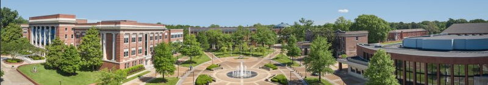

# Introduction to Groundwater Modeling Using MODFLOW

Instructors: Michael Fienen, Joseph Hughes, Chris Langevin, and Josh Larsen

September 11-15, 2023

University of Memphis

Memphis, TN

This 5-day course presents an introduction to groundwater flow simulation using MODFLOW.  The course will be taught using MODFLOW 6, the sixth major release of the MODFLOW program.  In addition to discussing the feature and mechanics of using MODFLOW 6, this course provides a review of the basic concepts of ground-water flow and emphasizes the process of simulation analysis.  A series of problem sets are presented that are designed to illustrate concepts such as the development of conceptual models and strategies for model calibration.  This course is intended as an introduction to groundwater flow modeling.  Hydrologists with extensive modeling experience looking primarily for an introduction to the new features of MODFLOW 6 should not take this course.


## Schedule
The course will start every morning at 8 am and end around 4:30 pm every day.

### Organization
Students will use their own laptop computers during the class.  A recent version of Windows is required.  Students will be notified about the class agenda, options for hotel accommodations, and specific classroom information at a later date.

## Monday
```
  8:00  Introductions [CL]
  8:30  Lecture - Overview of Groundwater Flow and Governing Equations [JL]
  9:45  Break
 10:00  Lecture - Overview of Finite-Difference Methods [MF]
 11:30  Lunch
 12:30  Lecture – MODFLOW Background [CL]
  1:00  Lecture – Getting Started with MODFLOW 6 [CL]
  1:45  Break
  2:00  Introduction to Problem 1 – Basic steady-state flow simulation [JH]
  2:15  Workshop – Building the MODFLOW data files for Problem 1 [JH]
  4:00  FloPy Demo – Problem 1 [JH]
  4:30  Adjourn
```

## Tuesday
```
  8:00  Lecture – Simulation Output [JL]
  8:30  Lecture – Introduction to pre- and post-processing tools for the class [CL]
  9:00  Workshop – Problem 1 (continued) [JL]
 10:00  Discussion – Problem 1 [JH]
 10:30  Lecture – Matrix Solvers [JH]
 11:30  Lunch
 12:30  Lecture – Storage (STO) and Traditional Stress Packages [CL]
  1:30  Break
  2:00  Introduction to Problem 2 – Stress packages and transient flow [MF]
  2:15  Workshop – Problem 2 [MF]
  4:30  Adjourn
```

## Wednesday
```
  8:00  Workshop – Problem 2 (continued) [MF]
  9:00  Discussion - Problem 2 [MF]
  9:30  Lecture/Workshop – ZoneBudget [CL]
 10:00  Break
 10:30  Lecture – Model Calibration [MF]
 11:30  Lunch
 12:30  Introduction to the McDonald Valley Calibration Problem [JH]
  1:00  Workshop – Planning phase [JH]
  2:00  Discussion – Group plans [JH]
  2:30  Workshop – Calibration with existing data [JH]
  4:30  Adjourn
```
 
## Thursday
```
  8:00  Lecture - Field Data Collection Options [CL]
  8:15  Workshop – Field Data Collection and Calibration Refinement [CL]
 10:15  Lecture - Model Projection Runs [JL]
 10:30  Workshop – Generate Model Projections  [JL]
 11:30  Lunch
 12:30  Workshop – Generate Model Projections (continued) [JL]
  2:00  Discussion – McDonald Valley Problem [JH]
  2:30  Break
  3:15  Lecture/Workshop – Advanced Topic: Lake Package [JH]
  4:30  Adjourn
```

## Friday
```
  8:00  Lecture/Workshop – Advanced Topics: Streamflow Routing Package [JH]
  9:00  Lecture/Workshop – Advanced Topics: Water Mover Package [JH]
  9:30  Lecture – Advanced Topics: MAW/UZF Packages [JH]
 10:00  Break
 10:15  Lecture/Workshop – Advanced Topics: Unstructured Grids [CL]
 10:45  Lecture/Workshop – Advanced Topics: XT3D [CL]
 11:30  Lunch
 12:30  Lecture/Workshop – Advanced Topics: Newton Formulation [JH]
  1:00  Lecture/Workshop – Advanced Topics: Local Grid Refinement [MF]
  1:30  Lecture – MODPATH Particle Tracking Overview [JL]
  2:00  Break
  2:15  Workshop – MODPATH Problem [JL]
  3:30  Lecture – Groundwater Transport Model [CL]
  3:45  Lecture - Coastal Boundaries and Saltwater Intrusion [CL]
  4:00  Wrap-up
  4:30  Adjourn
```
