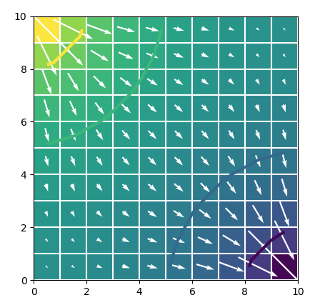

# Software Installation

This course requires that software be installed prior to arriving at the class.  Required software includes:

1.  USGS Modelviewer for MODFLOW 6 is available for download [here](https://www.usgs.gov/software/model-viewer-program-three-dimensional-visualization-ground-water-model-results) or [here](https://github.com/MODFLOW-USGS/modelviewer-mf6/releases/tag/1.0.0).  Online documentation for the program is available [here](https://modelviewer-mf6.readthedocs.io/en/latest/).

2.  FeatureGridder and HeadViewer are two Windows programs that are used as training tools for the class.  These programs are included in this repository in the software folder.  Neither of these programs have an installer; instead they can be run by double-clicking on the executable program.

3.  Python (preferably 3.10 or newer).  [Miniconda](https://docs.conda.io/en/latest/miniconda.html) is a popular Python distribution that runs on Windows, Mac, and Linux.

4.  Use conda to install a customized environment for FloPy and MODFLOW. The first step is create a file called `modflow_training_environment.yml`.  This file should contain the following contents.

```
name: modflow_training

channels:
  - conda-forge

dependencies:
  - python>=3.8
  - numpy>=1.15.0
  - matplotlib>=1.4.0
  - flopy
  - pyemu
  - python-dateutil>=2.4.0
  - affine
  - scipy
  - pandas
  - pyshp
  - rasterio
  - fiona
  - descartes
  - pyproj
  - shapely>=1.8
  - geos
  - geojson
  - vtk
  - rasterstats
  - pyvista
  - imageio
  - pymetis
  - trame
  - jupyter
```

After this file is created, run the following command from a terminal that has conda available.

```
$ conda env create -f modflow_training_environment.yml
```

Whenever you want to use this environment, you will need to activate it with the following command.

```
conda activate modflow_training
```

5.  Install MODFLOW executables and related programs.  After the environment has been installed and FloPy is available, MODFLOW executables can be downloaded to your computer using the [get-modflow](https://github.com/modflowpy/flopy/blob/develop/docs/get_modflow.md) utility, which is installed with FloPy. The following command is one way to use `get-modflow`, which will download the executables and make them available for use with FloPy scripts.  Make sure that the flopy environment is active before you run `get-modflow`.

```
$ get-modflow :flopy 
```

6.  To test is everything is working correctly, try copying the [MODFLOW 6 Quick Start](https://github.com/modflowpy/flopy#modflow-6-quick-start) FloPy tutorial into a jupyter notebook.  If everything is installed and working correctly, then you should see the image of a 10 by 10 model grid with flow from the upper left to the lower right.



